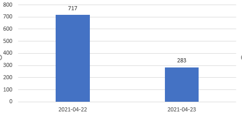
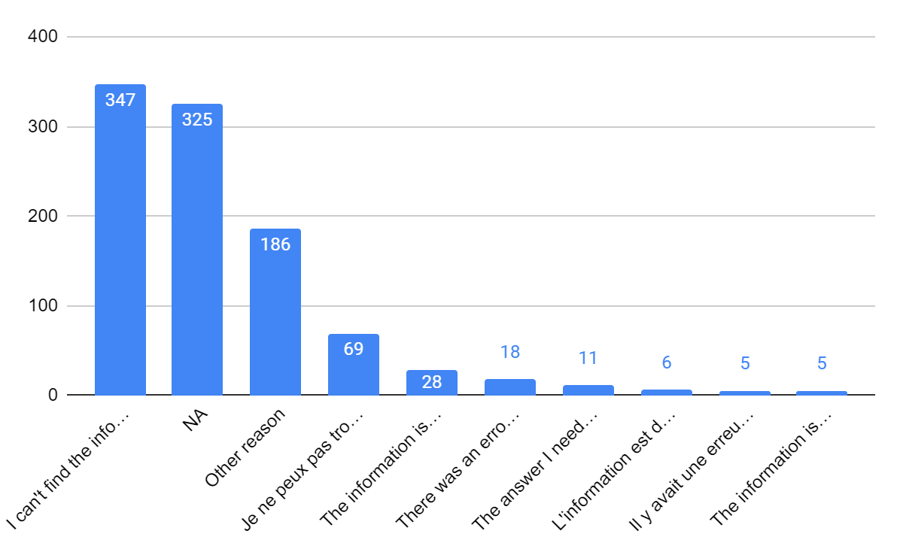
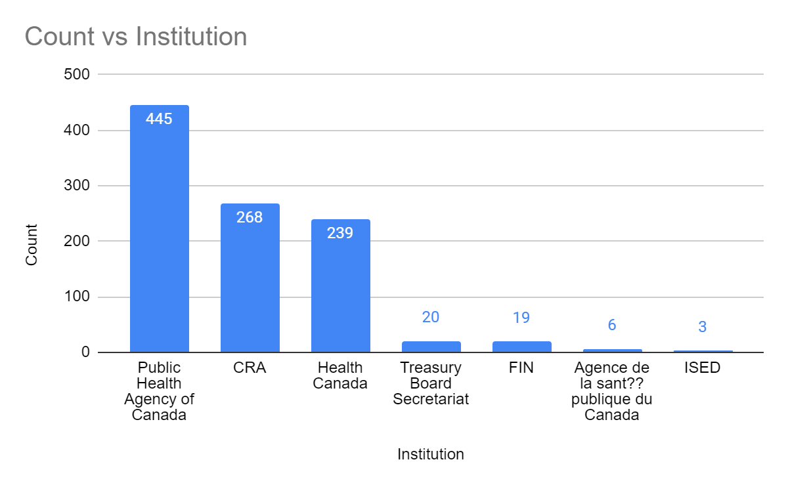
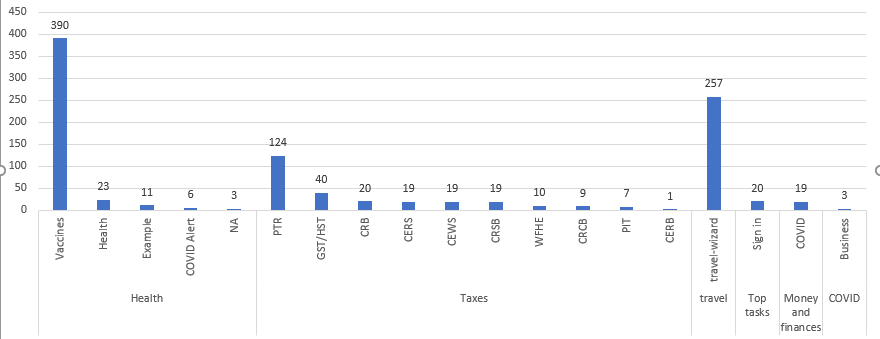
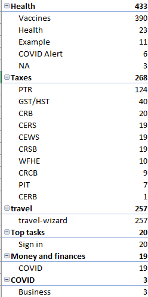

note: The following markdown was rendered based on [the docx version](https://github.com/elevenyao11/Capstone_tag_classification/blob/43331d8a65f738f0e232ba577f3cdceec8bf95fa/EDA/EDA_on_sample_data_of_Canada_CA.docx) on May 14th, 2021.  It is only for reference, when users view this using a web browser. In the event of any divergence between the two versions, the docx version shall prevail.

---
EDA on sample data
---

Features
========
| **column\_names** | **data\_type** | **categories\_count** |
| --- | --- | --- |
| Date | date | 2 |
| Comment | string | 1000 |
| Problem | string | 10 |
| Tags | string | 30 |
| URL | url | 162 |
| Language | string | 3 |
| Institution | string | 7 |
| Section | string | 19 |
| Theme | string | 6 |

**Question:**

What are the features and labels if it is supervised learning?

-Tags

Sample size and date
====================

> 

**Question:**

> What is the period of the whole dataset?
>
> -Feb 1, 2021 - past day

Problem distributions
=====================

| **Problem** | **Number** |
| --- | --- |
| I can&#39;t find the information | 347 |
| NA | 325 |
| Other reason | 186 |
| Je ne peux pas trouver l?€?information | 69 |
| The information is hard to understand | 28 |
| There was an error / something didn&#39;t work | 18 |
| The answer I need is missing | 11 |
| L&#39;information est difficile ?? comprendre | 6 |
| Il y avait une erreur / quelque chose ne fonctionnait pas | 5 |
| The information isn?€?t clear | 5 |

NAs in problem:

| **Comment** | **Problem** |
| --- | --- |
| Can I get vaccine the same day because my are giver | NA |
| je voudrais avoir mes resultats du test de covid 19 | NA |
| je veux m&#39;inscrire, prendre un rendez-vous svp | NA |
| What number to call? | NA |
| I want to book an appt for a Covid vaccine | NA |
| Maladie auto immune sont ils accept?? dans les maladies chroniques | NA |
| Comment trouver un hotel | NA |

**Questions:**

What are the rules of problems classification ?

Tags
====
| **Tags** | **Count** |
| --- | --- |
| NA | 198 |
| Getting vaccinated - When / Where / What | 128 |
| Hotels | 96 |
| Vaccine safety (health issues / ingredients / side effects / research) | 93 |
| Getting vaccinated - Registration / notifications | 90 |
| General Travel Restrictions | 59 |
| Can I enter Canada | 49 |
| Vaccine effectiveness / how they work / after vaccination | 44 |
| Eligibility | 36 |
| Vaccines and drugs | 33 |
| Applying / reapplying | 25 |
| Data and tracking vaccines | 23 |
| Testing | 19 |
| Accounts | 18 |
| Contact | 17 |
| Provincial restrictions | 13 |
| T4 information (T1/T4/T4A/T4E/R1) | 8 |
| Seniors (including OAS / GIS / CPP) | 8 |
| Quarantine | 7 |
| Vaccine strategy: Authorization / Eligibility / Priorities | 7 |
| Canada Recovery / Caregiver / Sickness Benefits | 6 |
| Page issue (e.g broken / link button / missing content) | 5 |
| Vaccines - Other | 4 |
| Income tax form or guide | 4 |
| Other (Contact / Travel outside / ArriveCan / Mad people ) | 3 |
| Design / content | 3 |
| EI | 1 |
| Symptoms | 1 |
| Calculation (calculator or spreadsheet) | 1 |
| Individual support (help finding support / other benefits / personal finances) | 1 |

Language
========

| **Language** | **Count** |
| --- | --- |
| en | 831 |
| fr | 168 |
| NA | 1 |

NA: the text is the phone number.

Institution
===========

> 

Section and Theme
=================

> 
>
> 
>
> **Question:**
>
> What's the difference between section and tag?
>
> **Question about communication:**
>
> Will our industry partner be interested in joining our group channel
> on Slack?
>
> **Question:**

1.  URL column: What are the URLs for? Is it where the users came from
    > when they didn't find the answer they wanted? Or is the URL where
    > the users are supposed to go to find the answer?

2.  Institution column: Do the users already know if their problem
    > belongs to a specific institution? (e.g. the user that asked 'Am I
    > eligible for vaccination?', do they know that the problem belongs
    > to Health Canada?)

3.  Theme column: Do the users already know if the answer to their
    > problem can be found in the specific Theme?

4.  Which columns are manually annotated and which are automatically
    > generated by the survey?

5.  How do they collect the text/comments? where they write the survey?
    > Do they write the survey under the corresponding link of the URL
    > column?

6.  Do labels have hierarchy?(predefined hierarchy/labels)

7.  Are NA tags due to unfinished labeling by the annotators or did the
    > annotator intentionally put NA because the comment is
    > uncategorizable?

> **Rough Project Plan**

1.  Language detection (En/Fr) ??

2.  Multi Classification task

    a.  Get an ontology/hierarchy of tags first!

3.  Interface

    a.  upload a tsv file → generate a document with comments + tags

PROJECT PLAN

1\. Description - Alex

Multi-classification tasks

2\. Datasets - Jan

3\. Expected deliverables - Alice

interface: user can either input a comment or a tsv/csv file

4\. Methods - Yundong

5\. Schedule - Everyone

May 10: Simple EDA, Experimenting with baseline model

May 17: Fine tuning, etc.

May 24:

May 31:

June 7:

June 14: Final report + presentation
